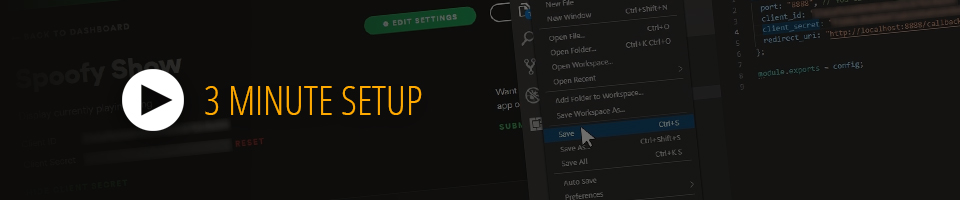
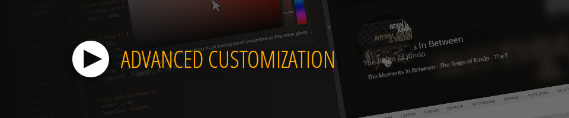

 
 
 
 

## First Time Setup:

The following two steps and spotify authorization only have to happen once. After that, you can start the app by running `node spoofy.js` or `_startSpoofy.bat`.

### 1) Inject your unique bits.

- Visit https://developer.spotify.com/dashboard/applications
- Make a new app.
- Set the `redirect uri` to `http://localhost:8888/callback`
- Grab your `client id`, `secret`, and put that info into `config.js`

### 2) Install them dependencies...

- Stick node on your machine: https://nodejs.org/en/download/
- Run `npm i -S cookie-parser cors express querystring request spotify-web-api-node` from inside the folder or `_installDependencies.bat`. (This may take a moment)

 
 
 
 

## Running the App

- Make sure you have a song playing (or paused) on your Spotify account.
- Run `node spoofy.js` from inside the folder or `_startSpoofy.bat`.
- Pop open your browser and visit http://localhost:8888
- First time will direct you to authorize with spotify.

 
 
 
 

## Customizing

- I've included a few theme files which can be swapped out in `public/index.html`.
- Use one of those themes and/or modify it however you'd like.

 
 
 
 

## Using with OBS

- With spoofy and spotify running, open OBS and make a new `Browser` source.
- Set the `URL` to `http://localhost:8888`.
- To sign into spotify, right click on this new source, then select `interact` towards the bottom of the context menu. You will only need to do this once.
- Move, resize and/or crop as needed.

Note: You only need to sign in once. If you need to clear that to sign in as a different user, you must move or delete this folder to force OBS to make a new cache: `C:\Users\%username%\AppData\Roaming\obs-studio\plugin_config\obs-browser\`

 
 
 
 

### Super Serious Disclaimer

I'm happy to help troubleshoot things, but can't be held responsible if you managed to explode your computer, delete the internet, incur the wrath of spotify, etc... Use at your own risk, and most importantly, enjoy. :)
